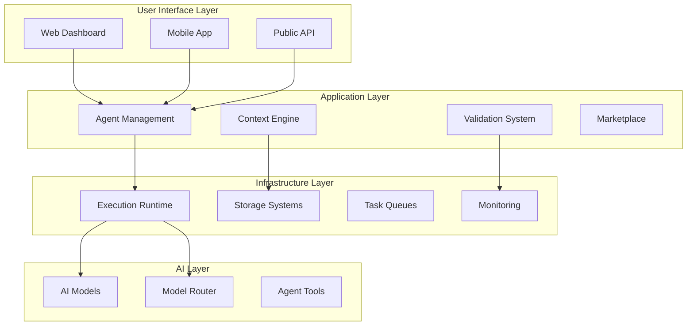

# BizQ Technical Architecture

**Context-First, Agent-Based Business Automation Platform**

---

## System Overview

BizQ is built on a revolutionary architecture that treats context and validation as first-class citizens, enabling autonomous AI agents to operate businesses with minimal human oversight.



---

## Core Components

### 1. Context Operating System (COS)

**Purpose**: Capture, organize, and serve business context to enable intelligent automation

```typescript
interface ContextOperatingSystem {
  // Context Collection Pipeline
  collection: {
    passive_collectors: {
      email_scanner: "Gmail, Outlook integration",
      document_processor: "Google Drive, Dropbox scanning",
      communication_monitor: "Slack, Discord tracking",
      transaction_analyzer: "Stripe, QuickBooks parsing"
    },
    
    active_collectors: {
      guided_interviews: "Progressive questionnaires",
      workflow_recording: "Screen capture and analysis",
      decision_documentation: "Choice reasoning capture",
      correction_learning: "Learn from user feedback"
    },
    
    synthetic_generation: {
      pattern_inference: "Deduce rules from behavior",
      gap_identification: "Find missing context",
      optimization_suggestions: "Improve context quality"
    }
  },

  // Context Storage Architecture
  storage: {
    hot_cache: {
      technology: "Redis Cluster",
      data: "Frequently accessed context",
      ttl: "1 hour",
      size: "~100MB per workspace"
    },
    
    primary_store: {
      technology: "PostgreSQL with JSONB",
      data: "Structured business rules and entities",
      indexing: "GIN indexes for fast queries",
      size: "~1GB per workspace"
    },
    
    vector_store: {
      technology: "Pinecone",
      data: "Semantic embeddings for similarity search",
      dimensions: 1536,
      size: "~500MB per workspace"
    },
    
    cold_archive: {
      technology: "S3",
      data: "Historical records and documents",
      compression: "Gzip",
      size: "~10GB per workspace"
    }
  },

  // Context Query Engine
  query_engine: {
    sql_queries: "Direct database queries for structured data",
    vector_search: "Semantic similarity for related context",
    graph_traversal: "Relationship navigation in knowledge graph",
    full_text_search: "Elasticsearch for document search"
  }
}
```

### 2. Agent Runtime System

**Purpose**: Execute, monitor, and manage autonomous AI agents

```typescript
interface AgentRuntime {
  // Agent Lifecycle Management
  lifecycle: {
    creation: {
      from_template: "Pre-built agent templates",
      custom_build: "Visual agent builder",
      import: "Community marketplace agents",
      clone: "Duplicate existing agents"
    },
    
    deployment: {
      testing: "Sandbox environment validation",
      staging: "Limited production testing",
      production: "Full deployment with monitoring",
      rollback: "Version control and rollback"
    },
    
    execution: {
      scheduling: "Cron-based and event-driven",
      orchestration: "Multi-agent coordination",
      resource_allocation: "Dynamic compute assignment",
      isolation: "Containerized execution"
    },
    
    retirement: {
      deactivation: "Graceful shutdown",
      archival: "Preserve configuration and history",
      replacement: "Smooth transition to new version"
    }
  },

  // Execution Engine
  execution: {
    // Container-based isolation
    containerization: {
      platform: "Docker + Kubernetes",
      isolation: "One container per agent execution",
      resources: {
        cpu: "0.5-2 cores per agent",
        memory: "512MB-2GB per agent",
        timeout: "30 seconds default"
      }
    },
    
    // Workflow orchestration
    orchestration: {
      engine: "Temporal",
      patterns: ["Sequential", "Parallel", "Conditional", "Loop"],
      error_handling: "Automatic retry with backoff",
      state_management: "Persistent workflow state"
    },
    
    // Tool execution
    tools: {
      internal: "Database queries, API calls",
      external: "Third-party integrations",
      custom: "User-defined functions",
      community: "Shared tool library"
    }
  },

  // Monitoring System
  monitoring: {
    real_time: {
      metrics: ["Latency", "Throughput", "Error rate"],
      logging: "Structured logs with OpenTelemetry",
      tracing: "Distributed tracing for workflows",
      alerting: "PagerDuty integration"
    },
    
    observability: {
      dashboard: "Grafana dashboards",
      metrics_store: "Prometheus time-series",
      log_aggregation: "Elasticsearch + Kibana",
      apm: "Application Performance Monitoring"
    },
    
    audit: {
      decision_log: "Every agent decision recorded",
      action_log: "All actions taken",
      data_access_log: "What data was accessed",
      compliance_log: "Regulatory compliance tracking"
    }
  }
}
```

### 3. Validation System

**Purpose**: Ensure agent outputs meet quality and security standards

```typescript
interface ValidationSystem {
  // Pre-execution Validation
  pre_validation: {
    context_check: {
      completeness: "Is required context available?",
      freshness: "Is context up-to-date?",
      consistency: "Does context conflict?",
      accuracy: "Is context verified?"
    },
    
    authorization: {
      permissions: "Does agent have necessary access?",
      limits: "Are thresholds exceeded?",
      compliance: "Does action meet regulations?",
      approval: "Is human approval needed?"
    },
    
    risk_assessment: {
      impact_analysis: "What could go wrong?",
      confidence_score: "How certain is success?",
      rollback_plan: "Can we undo if needed?",
      escalation_path: "Who to notify if issues?"
    }
  },

  // Real-time Validation
  runtime_validation: {
    stream_monitoring: {
      pattern_detection: "Watch for suspicious patterns",
      boundary_enforcement: "Stop if limits exceeded",
      quality_checking: "Ensure output quality",
      consistency_validation: "Check against history"
    },
    
    guardrails: {
      content_filtering: "Remove harmful content",
      pii_detection: "Prevent data leakage",
      rate_limiting: "Prevent abuse",
      circuit_breaking: "Stop cascading failures"
    }
  },

  // Post-execution Validation
  post_validation: {
    output_verification: {
      completeness: "All required fields present?",
      format: "Correct structure and format?",
      accuracy: "Factually correct?",
      quality: "Meets quality standards?"
    },
    
    business_logic: {
      rules_compliance: "Follows business rules?",
      consistency: "Consistent with past actions?",
      reasonableness: "Makes business sense?",
      optimization: "Could be improved?"
    }
  }
}
```

### 4. Multi-Tenant Database Architecture

**Purpose**: Secure, scalable data storage with complete isolation

```sql
-- Core workspace isolation
CREATE TABLE workspaces (
  id UUID PRIMARY KEY DEFAULT gen_random_uuid(),
  name TEXT NOT NULL,
  slug TEXT UNIQUE NOT NULL,
  plan TEXT NOT NULL,
  credits_balance INTEGER NOT NULL DEFAULT 1000,
  settings JSONB DEFAULT '{}'::jsonb,
  created_at TIMESTAMPTZ DEFAULT NOW()
);

-- Context storage with workspace isolation
CREATE TABLE context_entities (
  id UUID PRIMARY KEY DEFAULT gen_random_uuid(),
  workspace_id UUID NOT NULL REFERENCES workspaces(id),
  entity_type TEXT NOT NULL, -- 'customer', 'product', 'workflow', etc
  entity_data JSONB NOT NULL,
  embeddings VECTOR(1536), -- For semantic search
  created_at TIMESTAMPTZ DEFAULT NOW(),
  updated_at TIMESTAMPTZ DEFAULT NOW(),
  version INTEGER DEFAULT 1
);

-- Agent configurations
CREATE TABLE agents (
  id UUID PRIMARY KEY DEFAULT gen_random_uuid(),
  workspace_id UUID NOT NULL REFERENCES workspaces(id),
  name TEXT NOT NULL,
  type TEXT NOT NULL, -- 'customer_service', 'content_creator', etc
  configuration JSONB NOT NULL,
  permissions JSONB DEFAULT '{}'::jsonb,
  status TEXT DEFAULT 'active',
  version INTEGER DEFAULT 1,
  metrics JSONB DEFAULT '{}'::jsonb,
  created_at TIMESTAMPTZ DEFAULT NOW()
);

-- Task execution history
CREATE TABLE task_executions (
  id UUID PRIMARY KEY DEFAULT gen_random_uuid(),
  workspace_id UUID NOT NULL REFERENCES workspaces(id),
  agent_id UUID REFERENCES agents(id),
  task_type TEXT NOT NULL,
  input JSONB NOT NULL,
  output JSONB,
  validation_results JSONB,
  status TEXT NOT NULL,
  started_at TIMESTAMPTZ DEFAULT NOW(),
  completed_at TIMESTAMPTZ,
  duration_ms INTEGER,
  cost_credits INTEGER,
  error_details JSONB
);

-- Enable Row Level Security
ALTER TABLE context_entities ENABLE ROW LEVEL SECURITY;
ALTER TABLE agents ENABLE ROW LEVEL SECURITY;
ALTER TABLE task_executions ENABLE ROW LEVEL SECURITY;

-- RLS Policies
CREATE POLICY workspace_isolation ON context_entities
  FOR ALL USING (workspace_id = current_workspace_id());

CREATE POLICY workspace_isolation ON agents
  FOR ALL USING (workspace_id = current_workspace_id());

CREATE POLICY workspace_isolation ON task_executions
  FOR ALL USING (workspace_id = current_workspace_id());
```

---

## Microservices Architecture

### Service Breakdown

```typescript
interface MicroservicesArchitecture {
  // Core Services
  services: {
    // Context Service
    context_service: {
      responsibility: "Context CRUD and querying",
      technology: "NestJS + PostgreSQL",
      endpoints: [
        "POST /context/entities",
        "GET /context/search",
        "PUT /context/update",
        "GET /context/coverage"
      ],
      scaling: "Horizontal with read replicas"
    },
    
    // Agent Service
    agent_service: {
      responsibility: "Agent lifecycle management",
      technology: "NestJS + Redis",
      endpoints: [
        "POST /agents/create",
        "PUT /agents/configure",
        "POST /agents/execute",
        "GET /agents/status"
      ],
      scaling: "Horizontal with load balancing"
    },
    
    // Validation Service
    validation_service: {
      responsibility: "Pre/post validation",
      technology: "Go + Rules Engine",
      endpoints: [
        "POST /validate/pre-execution",
        "POST /validate/runtime",
        "POST /validate/output"
      ],
      scaling: "Stateless horizontal scaling"
    },
    
    // Execution Service
    execution_service: {
      responsibility: "Task execution orchestration",
      technology: "Temporal + Workers",
      patterns: "Event-driven with queues",
      scaling: "Worker pool auto-scaling"
    },
    
    // Marketplace Service
    marketplace_service: {
      responsibility: "Template and agent sharing",
      technology: "NestJS + S3",
      endpoints: [
        "GET /marketplace/templates",
        "POST /marketplace/publish",
        "POST /marketplace/purchase"
      ],
      scaling: "CDN for static content"
    }
  },

  // Communication Patterns
  communication: {
    synchronous: {
      protocol: "REST over HTTPS",
      authentication: "JWT tokens",
      rate_limiting: "Token bucket algorithm",
      circuit_breaking: "Hystrix pattern"
    },
    
    asynchronous: {
      message_queue: "RabbitMQ",
      event_bus: "Apache Kafka",
      patterns: ["Pub/Sub", "Request/Reply", "Streaming"],
      guarantees: "At-least-once delivery"
    },
    
    real_time: {
      websockets: "Socket.io",
      server_sent_events: "For progress updates",
      graphql_subscriptions: "For data changes"
    }
  }
}
```

---

## AI Integration Layer

### Model Management

```typescript
interface AIModelManagement {
  // Model Router
  router: {
    selection_criteria: {
      task_type: "Match model to task requirements",
      cost_optimization: "Balance quality vs cost",
      latency_requirements: "Fast vs thorough",
      availability: "Fallback if primary unavailable"
    },
    
    model_registry: {
      openai: {
        models: ["gpt-4", "gpt-3.5-turbo"],
        use_cases: ["Complex reasoning", "General tasks"],
        cost: ["$0.03/1K tokens", "$0.002/1K tokens"]
      },
      anthropic: {
        models: ["claude-3-opus", "claude-3-sonnet"],
        use_cases: ["Creative writing", "Analysis"],
        cost: ["$0.015/1K tokens", "$0.003/1K tokens"]
      },
      local: {
        models: ["llama-2", "mistral"],
        use_cases: ["Privacy-sensitive", "High-volume"],
        cost: ["Infrastructure only"]
      }
    }
  },

  // Prompt Engineering
  prompt_system: {
    template_engine: {
      system_prompts: "Immutable security and role definition",
      context_injection: "Dynamic context insertion",
      output_formatting: "Structured output schemas",
      few_shot_examples: "Task-specific examples"
    },
    
    security_layer: {
      sanitization: "Input cleaning and validation",
      sandboxing: "Isolated execution environment",
      output_filtering: "Remove sensitive information",
      audit_logging: "Track all prompts and outputs"
    }
  },

  // Tool Integration
  agent_tools: {
    internal_apis: {
      database: "Query workspace data",
      storage: "Access files and documents",
      compute: "Run calculations and analysis"
    },
    
    external_apis: {
      shopify: "E-commerce operations",
      stripe: "Payment processing",
      sendgrid: "Email sending",
      twilio: "SMS and voice"
    },
    
    custom_functions: {
      user_defined: "Custom business logic",
      community_shared: "Verified community tools",
      marketplace: "Premium tool subscriptions"
    }
  }
}
```

---

## Security Architecture

### Defense in Depth

```typescript
interface SecurityArchitecture {
  // Network Security
  network: {
    waf: "Cloudflare Web Application Firewall",
    ddos_protection: "Cloudflare DDoS mitigation",
    tls: "TLS 1.3 everywhere",
    vpc: "Private networking for services"
  },

  // Application Security
  application: {
    authentication: {
      provider: "Supabase Auth / Auth0",
      mfa: "TOTP and SMS support",
      sso: "SAML and OAuth support",
      session_management: "Secure JWT with refresh"
    },
    
    authorization: {
      model: "RBAC with workspace isolation",
      policies: "OPA (Open Policy Agent)",
      api_keys: "Scoped API key management",
      rate_limiting: "Per-user and per-IP"
    },
    
    data_protection: {
      encryption_at_rest: "AES-256",
      encryption_in_transit: "TLS 1.3",
      key_management: "AWS KMS / Vault",
      pii_handling: "Automatic masking and tokenization"
    }
  },

  // Agent Security
  agent_security: {
    sandboxing: "Container isolation",
    resource_limits: "CPU, memory, network quotas",
    permission_boundaries: "Least privilege principle",
    audit_trail: "Complete execution history"
  },

  // Compliance
  compliance: {
    gdpr: "Data privacy and right to deletion",
    ccpa: "California privacy compliance",
    soc2: "Security controls audit",
    hipaa: "Healthcare data handling (future)"
  }
}
```

---

## Deployment Architecture

### Multi-Region Deployment

```typescript
interface DeploymentArchitecture {
  // Infrastructure as Code
  iac: {
    tool: "Terraform",
    providers: ["AWS", "Cloudflare", "Vercel"],
    environments: ["Development", "Staging", "Production"]
  },

  // Container Orchestration
  orchestration: {
    platform: "Kubernetes (EKS)",
    container_registry: "ECR",
    service_mesh: "Istio",
    ingress: "NGINX Ingress Controller"
  },

  // Service Deployment
  services: {
    frontend: {
      platform: "Vercel",
      cdn: "Vercel Edge Network",
      regions: ["us-east-1", "eu-west-1", "ap-southeast-1"]
    },
    
    api: {
      platform: "Fly.io",
      regions: ["iad", "lhr", "sin"],
      auto_scaling: "Based on CPU and request rate"
    },
    
    workers: {
      platform: "Cloudflare Workers",
      distribution: "Global edge network",
      limits: "10ms CPU time per request"
    },
    
    database: {
      provider: "Supabase",
      regions: ["us-east-1", "eu-central-1"],
      replication: "Read replicas in each region"
    }
  },

  // CI/CD Pipeline
  cicd: {
    vcs: "GitHub",
    ci: "GitHub Actions",
    testing: ["Unit", "Integration", "E2E", "Performance"],
    deployment: {
      strategy: "Blue-green deployment",
      rollback: "Automatic on failure",
      monitoring: "Deployment tracking with Datadog"
    }
  }
}
```

---

## Monitoring & Observability

### Comprehensive Monitoring Stack

```typescript
interface MonitoringStack {
  // Metrics Collection
  metrics: {
    collection: "Prometheus + Grafana",
    custom_metrics: {
      agent_performance: "Success rate, latency, throughput",
      context_coverage: "Completeness percentage by category",
      validation_accuracy: "False positive/negative rates",
      business_value: "Time saved, tasks automated"
    },
    
    dashboards: [
      "Executive Overview",
      "Agent Performance",
      "System Health",
      "User Analytics"
    ]
  },

  // Logging
  logging: {
    aggregation: "Elasticsearch + Logstash + Kibana",
    structure: "JSON structured logging",
    retention: "30 days hot, 90 days warm, 1 year cold",
    
    log_levels: {
      error: "System errors and failures",
      warn: "Degraded performance or issues",
      info: "Normal operations",
      debug: "Detailed debugging information"
    }
  },

  // Tracing
  tracing: {
    platform: "Jaeger / Datadog APM",
    instrumentation: "OpenTelemetry",
    sampling: "1% for normal, 100% for errors",
    
    trace_points: [
      "API request lifecycle",
      "Agent execution flow",
      "Database queries",
      "External API calls"
    ]
  },

  // Alerting
  alerting: {
    platform: "PagerDuty + Slack",
    
    severity_levels: {
      critical: "System down, data loss risk",
      high: "Degraded service, high error rate",
      medium: "Performance issues, non-critical errors",
      low: "Informational, optimization opportunities"
    },
    
    escalation: {
      level_1: "On-call engineer (0-5 min)",
      level_2: "Team lead (5-15 min)",
      level_3: "CTO (15+ min)"
    }
  }
}
```

---

## Performance Optimization

### Optimization Strategies

```typescript
interface PerformanceOptimization {
  // Caching Strategy
  caching: {
    cdn: {
      provider: "Cloudflare",
      strategy: "Cache static assets at edge",
      ttl: "1 year for assets, 5 min for API"
    },
    
    application: {
      redis: "Session and frequently accessed data",
      memory: "In-process caching for hot data",
      database: "Materialized views for complex queries"
    },
    
    ai_responses: {
      strategy: "Cache by input hash",
      ttl: "1 hour for general, 5 min for dynamic",
      invalidation: "On context update"
    }
  },

  // Database Optimization
  database: {
    indexing: "B-tree for equality, GIN for JSONB",
    partitioning: "By workspace_id and date",
    connection_pooling: "PgBouncer",
    read_replicas: "For read-heavy operations"
  },

  // API Optimization
  api: {
    pagination: "Cursor-based for large datasets",
    field_selection: "GraphQL-style field filtering",
    batch_operations: "Combine multiple operations",
    compression: "Gzip for responses > 1KB"
  },

  // Agent Execution
  agent_optimization: {
    parallel_execution: "Run independent agents in parallel",
    batch_processing: "Group similar tasks",
    resource_pooling: "Reuse connections and contexts",
    predictive_loading: "Pre-load likely next contexts"
  }
}
```

---

## Disaster Recovery

### Business Continuity Plan

```typescript
interface DisasterRecovery {
  // Backup Strategy
  backups: {
    database: {
      frequency: "Continuous replication + hourly snapshots",
      retention: "7 days hourly, 30 days daily, 1 year monthly",
      location: "Cross-region S3 buckets",
      testing: "Monthly restore tests"
    },
    
    context_data: {
      strategy: "Incremental backups with full weekly",
      encryption: "AES-256 encrypted backups",
      versioning: "Keep last 10 versions"
    }
  },

  // Recovery Procedures
  recovery: {
    rto: "4 hours", // Recovery Time Objective
    rpo: "1 hour",  // Recovery Point Objective
    
    scenarios: {
      region_failure: "Failover to secondary region",
      data_corruption: "Restore from clean backup",
      security_breach: "Isolate, patch, restore",
      agent_malfunction: "Rollback to previous version"
    }
  },

  // High Availability
  high_availability: {
    architecture: "Active-passive with hot standby",
    load_balancing: "Multi-region with health checks",
    database: "Multi-master replication",
    monitoring: "24/7 automated health checks"
  }
}
```

---

## Scalability Planning

### Growth Architecture

```typescript
interface ScalabilityPlan {
  // Horizontal Scaling
  horizontal: {
    api_servers: "Auto-scale 2-100 instances",
    agent_workers: "Scale 10-1000 workers",
    database: "Read replicas and sharding",
    cache: "Redis cluster mode"
  },

  // Vertical Scaling
  vertical: {
    database: "Up to 96 vCPUs, 384GB RAM",
    cache: "Up to 250GB Redis",
    compute: "GPU instances for AI workloads"
  },

  // Performance Targets
  targets: {
    concurrent_users: "100,000",
    requests_per_second: "10,000",
    agents_running: "50,000 concurrent",
    data_storage: "10PB total"
  },

  // Growth Stages
  stages: {
    mvp: "100 users, 1 region",
    growth: "10,000 users, 3 regions",
    scale: "100,000 users, global",
    enterprise: "1M+ users, private deployments"
  }
}
```

---

## Technology Stack Summary

### Core Technologies

| Layer | Technology | Purpose |
|-------|------------|---------|
| Frontend | Next.js 15, React 19, TypeScript | Modern web application |
| UI | Shadcn/ui, Tailwind CSS | Component library and styling |
| Backend | NestJS, Node.js | API and business logic |
| Database | PostgreSQL (Supabase) | Primary data store |
| Cache | Redis | High-performance caching |
| Search | Elasticsearch | Full-text search |
| Vector DB | Pinecone | Semantic search |
| Queue | RabbitMQ | Message queuing |
| AI | OpenAI, Anthropic, Local models | AI processing |
| Monitoring | Prometheus, Grafana, ELK | Observability |
| Infrastructure | Kubernetes, Terraform | Container orchestration and IaC |
| CDN | Cloudflare | Edge caching and protection |

---

## Development Principles

### Best Practices

1. **Context-First Development**: Every feature considers context capture and usage
2. **Agent Isolation**: Agents run in isolated environments with clear boundaries
3. **Validation by Default**: All outputs validated before delivery
4. **Security in Depth**: Multiple layers of security at every level
5. **Observable by Design**: Comprehensive monitoring and logging
6. **Scalable Architecture**: Built to handle 100x growth
7. **User Privacy**: Data isolation and encryption throughout
8. **Community-Driven**: Extensible through marketplace and APIs

---

*"Architecture that scales from 1 to 1 million users without fundamental changes."*