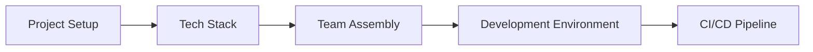

# BizQ Implementation Roadmap

**Execution Strategy: From MVP to Market Leader**

---

## Executive Overview

This roadmap outlines the systematic implementation of BizQ's revolutionary context-first, agent-based platform. We're not just building another AI tool - we're creating the operating system for modern business automation.

**Core Innovation**: Context and validation as first-class citizens, managed by transparent AI agents.

**Timeline**: 16 weeks from inception to full platform
**Budget**: $500K initial investment
**Target**: 5,000 active businesses by Month 6

---

## Implementation Phases

### Phase 0: Foundation (Week 0)
**Objective**: Set up development environment and core infrastructure



**Key Deliverables**:
- Monorepo structure with Turborepo
- Development environment setup
- CI/CD pipeline configuration
- Team onboarding and alignment

---

## Phase 1: MVP - Core Task Automation (Weeks 1-4)

### Week 1-2: Foundation Infrastructure

#### Context Collection System
```typescript
// Minimal viable context system
class MVPContextSystem {
  // Start with email and document scanning only
  collectors = [
    new EmailCollector({ 
      providers: ['gmail', 'outlook'],
      extractPatterns: true 
    }),
    new DocumentScanner({ 
      sources: ['gdrive', 'dropbox'],
      autoIndex: true 
    })
  ];
  
  // Simple storage (no complex graph yet)
  storage = new SimpleContextStore({
    database: 'supabase',
    vectorSearch: 'basic_embeddings'
  });
}
```

#### Basic Validation
```typescript
// MVP validation - focus on safety
class MVPValidator {
  async validate(task: Task): Promise<boolean> {
    // Essential checks only
    const checks = [
      this.checkDataAccess(task),
      this.checkCostLimits(task),
      this.checkOutputSafety(task)
    ];
    
    return checks.every(check => check.passed);
  }
}
```

### Week 3-4: Five Core Tasks

**Task Priority** (based on user research):

1. **Product Description Generator** 
   - Highest ROI
   - 4 hours → 5 minutes
   - Clear quality metrics

2. **Customer Service Response**
   - Daily necessity
   - 2-4 hours saved daily
   - Immediate impact

3. **Social Media Content**
   - High frequency need
   - Visual results
   - Easy to evaluate

4. **Order Processing**
   - Operational efficiency
   - Measurable time savings
   - Automation showcase

5. **Daily Analytics Report**
   - Business intelligence
   - Decision support
   - Daily value

**MVP Success Criteria**:
- 100 beta users
- 95% task success rate
- 3+ hours saved per user daily
- 4.5+ quality rating

---

## Phase 2: Agent Intelligence (Weeks 5-8)

### Week 5-6: Agent Framework

#### Agent Types
```typescript
interface MVPAgents {
  customerService: {
    capabilities: ['inquiries', 'complaints', 'escalation'],
    learning: 'from_corrections',
    autonomy: 'supervised'
  },
  contentCreation: {
    capabilities: ['product_desc', 'social_posts', 'emails'],
    learning: 'from_examples',
    autonomy: 'review_required'
  },
  orderProcessing: {
    capabilities: ['validation', 'fulfillment', 'tracking'],
    learning: 'from_patterns',
    autonomy: 'rule_based'
  }
}
```

#### Agent Management UI
```tsx
// Simple agent dashboard
function AgentDashboard() {
  return (
    <div>
      <AgentGrid agents={agents} />
      <LiveActivity />
      <QuickControls />
    </div>
  );
}
```

### Week 7-8: Learning & Improvement

**Progressive Trust System**:
1. **Observation Mode**: Agent suggests, human acts
2. **Approval Mode**: Agent acts with approval
3. **Supervised Mode**: Agent acts, human reviews
4. **Autonomous Mode**: Agent acts independently

**Learning Mechanisms**:
- Correction-based learning
- Pattern recognition
- Community knowledge sharing
- Continuous improvement loops

---

## Phase 3: Community Economy (Weeks 9-12)

### Week 9-10: Task Marketplace

#### Platform Integration
```typescript
interface CommunityPlatforms {
  linkedin: {
    tasks: ['professional_writing', 'research', 'analysis'],
    pricing: 'premium',
    vetting: 'professional_verification'
  },
  reddit: {
    tasks: ['market_research', 'sentiment_analysis'],
    pricing: 'competitive',
    vetting: 'karma_based'
  },
  discord: {
    tasks: ['real_time_support', 'community_management'],
    pricing: 'hourly',
    vetting: 'role_based'
  }
}
```

### Week 11-12: Agent Marketplace

**Revenue Model**:
- Template sales: 30% commission
- Agent marketplace: 20% commission
- Task fulfillment: 10-15% transaction fee
- Premium features: Subscription upgrades

---

## Phase 4: Scale & Polish (Weeks 13-16)

### Week 13-14: Performance & Security

#### Security Hardening
- Multi-layer input validation
- Agent sandboxing
- Complete audit trails
- GDPR/CCPA compliance

#### Performance Optimization
- Context caching strategy
- Agent pooling
- Database optimization
- CDN implementation

### Week 15-16: Production Launch

#### Launch Checklist
- [ ] Load testing (10,000 concurrent users)
- [ ] Security audit completed
- [ ] Monitoring dashboards live
- [ ] Support documentation ready
- [ ] Marketing site launched
- [ ] Beta user migration plan

---

## Parallel Workstreams

### Continuous Throughout All Phases

#### 1. User Research & Feedback
- Weekly user interviews
- In-app feedback collection
- Usage analytics
- A/B testing

#### 2. Community Building
- Discord server launch (Week 2)
- Weekly office hours
- Community challenges
- Early adopter program

#### 3. Content & Marketing
- Blog posts (2x weekly)
- Product demos
- Case studies
- SEO optimization

---

## Resource Allocation

### Team Structure

```
CTO/Technical Lead
├── Backend Team (2 engineers)
│   ├── Context/Validation Systems
│   └── Agent Runtime
├── Frontend Team (2 engineers)
│   ├── Dashboard
│   └── Agent Management UI
├── AI/ML Engineer
│   ├── Model optimization
│   └── Agent training
└── DevOps Engineer
    ├── Infrastructure
    └── Monitoring

CPO/Product Lead
├── Product Manager
├── UX Designer
└── User Researcher

Growth Lead
├── Marketing Manager
└── Community Manager
```

### Budget Breakdown (16 weeks)

| Category | Amount | Details |
|----------|--------|----------|
| Development | $300K | 7 engineers × 16 weeks |
| Infrastructure | $40K | Cloud, services, tools |
| AI/API Costs | $30K | OpenAI, Anthropic, embeddings |
| Marketing | $50K | Launch campaign, content |
| Operations | $30K | Legal, accounting, misc |
| Buffer | $50K | Contingency (~10%) |
| **Total** | **$500K** | |

---

## Success Metrics & Milestones

### Phase 1 (Weeks 1-4)
- ✓ 5 core tasks automated
- ✓ 100 beta users
- ✓ 95% task success rate
- ✓ Basic context system live

### Phase 2 (Weeks 5-8)
- ✓ 3 agent types deployed
- ✓ Agent management UI
- ✓ 500 active users
- ✓ Progressive trust system

### Phase 3 (Weeks 9-12)
- ✓ Community marketplace launch
- ✓ 1,000 active users
- ✓ First revenue from marketplace
- ✓ 50+ community templates

### Phase 4 (Weeks 13-16)
- ✓ 5,000 active users
- ✓ $100K MRR
- ✓ 99.9% uptime
- ✓ Full platform launch

---

## Risk Management

### Technical Risks & Mitigation

| Risk | Impact | Likelihood | Mitigation |
|------|--------|------------|------------|
| AI hallucination | High | Medium | Multi-layer validation, human review |
| Scaling issues | High | Low | Progressive rollout, load testing |
| Security breach | Critical | Low | Security-first design, audits |
| Integration failures | Medium | Medium | Retry logic, fallbacks |

### Business Risks & Mitigation

| Risk | Impact | Likelihood | Mitigation |
|------|--------|------------|------------|
| Slow adoption | High | Medium | Strong onboarding, immediate value |
| Competition | High | High | Unique approach, fast iteration |
| Churn | Medium | Medium | Continuous improvement, support |
| Regulation | Medium | Low | Compliance by design |

---

## Go-to-Market Strategy

### Launch Sequence

#### Week 4: Private Beta
- 100 hand-picked users
- Direct onboarding support
- Daily feedback calls
- Rapid iteration

#### Week 8: Public Beta
- 1,000 user target
- Self-serve onboarding
- Community support
- Feature voting

#### Week 12: Soft Launch
- Product Hunt launch
- Press embargo lift
- Influencer outreach
- Case study publication

#### Week 16: Full Launch
- Paid advertising
- Partnership announcements
- Enterprise tier
- API access

### Pricing Strategy Evolution

```typescript
interface PricingEvolution {
  beta: {
    price: 'Free',
    duration: 'Weeks 1-8',
    value: 'Early access, shape product'
  },
  earlyBird: {
    price: '$47/month',
    duration: 'Weeks 9-12',
    value: '50% lifetime discount'
  },
  launch: {
    starter: '$97/month',
    growth: '$297/month',
    scale: '$997/month',
    enterprise: 'Custom'
  }
}
```

---

## Technology Decisions

### Core Stack Rationale

| Choice | Technology | Why |
|--------|------------|-----|
| Frontend | Next.js 15 | Latest features, great DX |
| Backend | NestJS | Scalable, enterprise-ready |
| Database | Supabase | Managed Postgres, real-time |
| AI | Vercel AI SDK | Unified interface, streaming |
| Deployment | Vercel + Fly | Global edge, auto-scaling |
| Monitoring | Sentry + PostHog | Errors + analytics |

### Build vs Buy Decisions

**Build**:
- Context system (core IP)
- Agent framework (competitive advantage)
- Validation system (unique approach)

**Buy/Use Existing**:
- Authentication (Supabase Auth)
- Payments (Stripe)
- Email (SendGrid)
- Analytics (PostHog)

---

## Critical Success Factors

### Must-Have for Success

1. **Exceptional Onboarding**
   - Time to first value: <10 minutes
   - Guided setup with sample data
   - Immediate "wow" moment

2. **Reliable Task Execution**
   - 95%+ success rate
   - Clear error messages
   - Easy correction/retry

3. **Visible Time Savings**
   - Dashboard showing hours saved
   - Before/after comparisons
   - ROI calculator

4. **Trust Building**
   - Complete transparency
   - Audit trails
   - Human oversight options

5. **Community Engagement**
   - Active Discord/Slack
   - Weekly office hours
   - User-generated content

---

## Post-Launch Roadmap

### Month 6-12: Expansion

- Mobile applications
- Advanced workflow automation
- Enterprise features
- International expansion
- Additional AI models
- Vertical-specific agents

### Year 2: Platform Evolution

- White-label solutions
- API marketplace
- Developer ecosystem
- Acquisition opportunities
- Industry partnerships
- IPO preparation

---

## Conclusion

This roadmap provides a clear, actionable path to building and launching BizQ. By focusing on immediate value delivery while building towards a revolutionary platform, we can achieve product-market fit quickly while maintaining our long-term vision.

**Key Principles**:
1. Ship fast, learn quickly
2. Context and validation first
3. Trust through transparency
4. Community-driven development
5. Progressive enhancement

The combination of proven patterns (from successful projects like Midday) and innovative approaches (context-first, agent-based) positions BizQ to become the definitive business automation platform.

---

*"16 weeks to transform how businesses operate. BizQ: Where AI meets business reality."*

**Next Steps**:
1. Finalize team assembly
2. Set up development environment
3. Begin Week 1 sprint
4. Launch community Discord
5. Start user recruitment

Let's build the future of business automation. 🚀